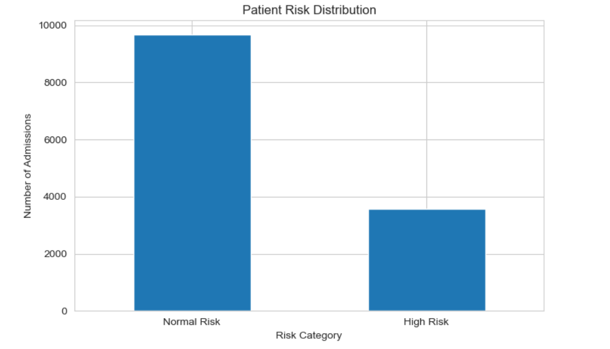
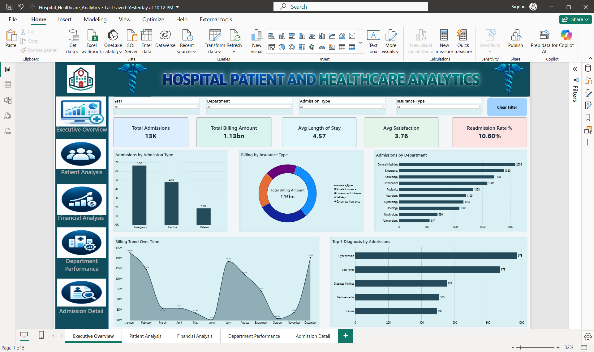
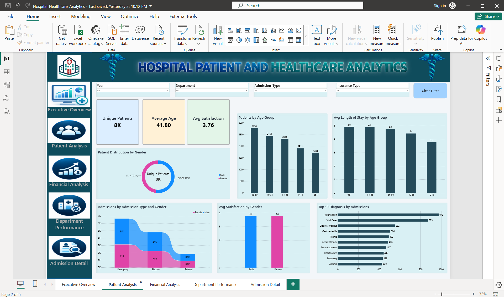
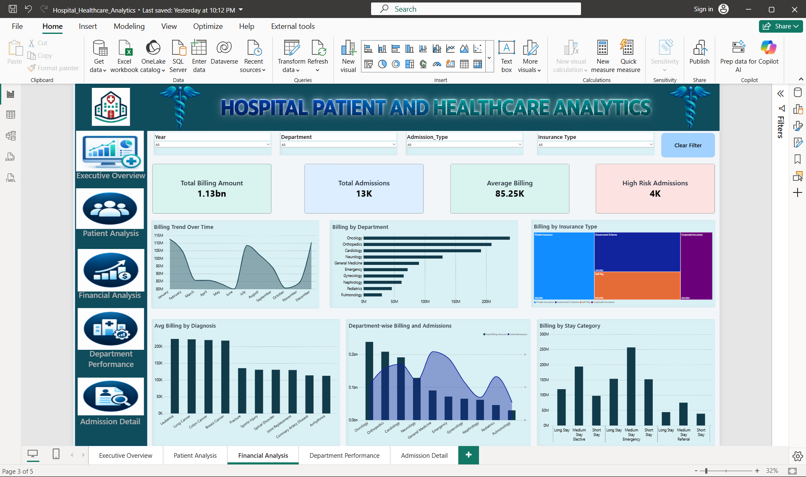
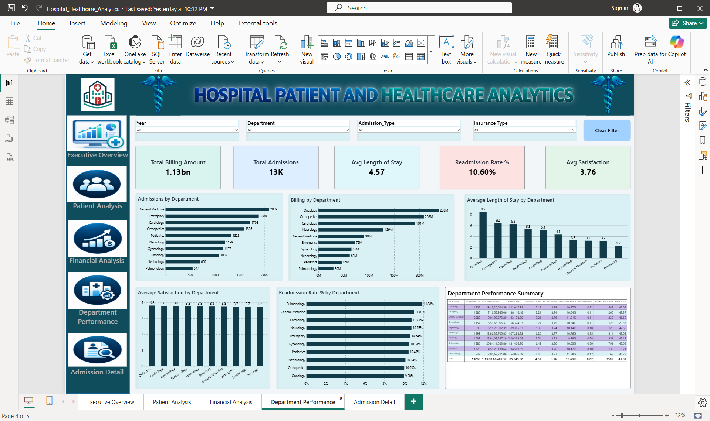

# 🏥 Hospital Patient & Healthcare Analytics

An end-to-end **Healthcare Data Analytics project** developed using **Python, MySQL, Machine Learning, and Power BI**.

The project analyzes **13,266 hospital admission records** to understand patient demographics, admission behavior, department performance, billing patterns, length of stay, patient satisfaction, and 30-day readmission risk.

In addition to descriptive analysis, the project includes **feature engineering, statistical analysis, billing outlier detection, patient risk segmentation, correlation analysis, SQL-based analysis, Logistic Regression modeling, and an interactive Power BI dashboard with drill-through functionality**.

> ⚠️ **Dataset Disclaimer:** The healthcare dataset used in this project is synthetic and intended for educational and portfolio purposes. It does not contain real patient information.

---

## 🎯 Project Objectives

The project was designed to answer questions such as:

- How do hospital admissions vary across departments?
- Which departments handle the highest patient volume?
- Which departments have higher billing amounts?
- What factors are associated with longer hospital stays?
- Which departments show higher readmission rates?
- How does patient satisfaction vary across departments?
- Which admissions can be classified as higher risk?
- Are there unusual or extreme billing records?
- How are billing amount and length of stay related?
- Can 30-day readmission risk be estimated using available admission characteristics?

---

## 📊 Dataset Overview

| Metric | Value |
|---|---:|
| Admission Records | 13,266 |
| Original Features | 14 |
| Duplicate Records | 0 |
| Analysis Type | Hospital Admission Analytics |
| ML Target | 30-Day Readmission |

### Original Fields

- `admission_id`
- `patient_id`
- `admission_date`
- `department`
- `diagnosis`
- `age`
- `gender`
- `insurance_type`
- `admission_type`
- `length_of_stay_days`
- `billing_amount`
- `discharge_status`
- `is_readmission_30d`
- `patient_satisfaction`

---

## 🛠️ Technologies Used

| Technology | Purpose |
|---|---|
| **Python** | Data cleaning, analysis and feature engineering |
| **Pandas** | Data manipulation |
| **NumPy** | Numerical analysis and risk segmentation |
| **Matplotlib** | Data visualization |
| **Scikit-learn** | Machine Learning |
| **Jupyter Notebook** | Python development environment |
| **MySQL** | Database and SQL analysis |
| **SQLAlchemy / PyMySQL** | Python-MySQL integration |
| **Power BI** | Dashboard and interactive analysis |
| **DAX** | KPI and analytical calculations |

---

## 🔄 Project Workflow

```text
Raw Hospital Dataset
        ↓
Data Inspection & Quality Checks
        ↓
Data Cleaning
        ↓
Feature Engineering
        ↓
Exploratory Data Analysis
        ↓
Hospital KPI Analysis
        ↓
Advanced Statistical Analysis
        ↓
Billing Outlier Detection
        ↓
Patient Risk Segmentation
        ↓
Correlation Analysis
        ↓
30-Day Readmission Modeling
        ↓
MySQL Database Integration
        ↓
SQL Business Analysis
        ↓
Power BI Dashboard
        ↓
Drill-Through Detail Analysis
        ↓
Insights & Recommendations
```

---


# 🐍 Python Analytics

The complete Python analysis is available in:

```text
notebooks/hospital_analytics.ipynb
```

---

## 1️⃣ Data Inspection

Initial inspection included:

- Dataset dimensions
- Column names
- Data types
- Missing values
- Duplicate records
- Numerical distributions
- Categorical values

```python
import pandas as pd
import numpy as np

df = pd.read_csv(
    "../data/raw/hospital_admissions_data.csv"
)

print(df.shape)
print(df.info())
print(df.isnull().sum())
print("Duplicates:", df.duplicated().sum())
```

---

## 2️⃣ Data Cleaning

The data preparation process included:

- Converting admission dates to datetime
- Handling missing patient satisfaction values
- Validating numeric columns
- Checking duplicate records
- Preparing readmission values for analysis

```python
df["admission_date"] = pd.to_datetime(
    df["admission_date"]
)

df["patient_satisfaction"] = (
    df["patient_satisfaction"]
    .fillna(df["patient_satisfaction"].median())
)
```

---

## 3️⃣ Feature Engineering

Additional fields were created to support deeper analysis.

### Engineered Features

- `age_group`
- `stay_category`
- `admission_year`
- `admission_month`
- `admission_month_no`
- `admission_quarter`
- `billing_category`
- `readmission_status`
- `billing_outlier`
- `patient_risk`

Example:

```python
df["stay_category"] = pd.cut(
    df["length_of_stay_days"],
    bins=[-1, 3, 7, float("inf")],
    labels=[
        "Short Stay",
        "Medium Stay",
        "Long Stay"
    ]
)

df["admission_year"] = (
    df["admission_date"].dt.year
)

df["admission_month"] = (
    df["admission_date"].dt.month_name()
)
```

---

# 📈 Advanced Analytics

## Billing Outlier Detection

The **Interquartile Range (IQR)** method was used to identify unusual billing records.

```text
Q1                  : 40,973.27
Q3                  : 117,875.33
IQR                 : 76,902.06
Billing Outliers    : 449
Outlier Percentage  : 3.38%
```

These records can be investigated separately to understand unusually high billing activity.

---

## Department Performance Analysis

Departments were evaluated using multiple healthcare and operational metrics:

- Total Admissions
- Average Billing
- Average Length of Stay
- Readmission Rate
- Average Patient Satisfaction

Important observations include:

- **General Medicine:** 2,089 admissions
- **Emergency:** 1,880 admissions
- **Pulmonology:** highest readmission rate at approximately 11.88%
- **Oncology:** highest average billing at approximately ₹220,339.69
- **Oncology:** longest average stay at approximately 8.54 days
- **Orthopedics:** highest average satisfaction at approximately 3.80

---

## 🚨 Patient Risk Segmentation

A custom analytical segmentation was created to classify admissions into:

- **High Risk**
- **Normal Risk**

Results:

```text
High Risk Admissions    : 3,585
High Risk Percentage    : 27.02%

Normal Risk Admissions  : 9,681
Normal Risk Percentage  : 72.98%
```

The segmentation considers high billing, longer hospital stays, and readmission status.

---

## 🔗 Correlation Analysis

Correlation analysis was used to study relationships among clinical and financial variables.

Key result:

```text
Length of Stay ↔ Billing Amount = 0.67
```

This was the strongest observed relationship in the selected variables.

Another observed relationship:

```text
Patient Satisfaction ↔ Readmission = -0.14
```

---

# 🤖 Machine Learning — 30-Day Readmission Prediction

A **Logistic Regression classification model** was used to analyze 30-day readmission risk.

### Target

```text
is_readmission_30d
```

### Model Features

The model uses patient and admission characteristics such as:

- Age
- Length of Stay
- Billing Amount
- Department
- Insurance Type
- Admission Type
- Gender

Categorical variables were encoded before modeling and numerical variables were prepared for Logistic Regression.

---

## 📈 Model Performance & Advanced Analytics

### **ROC-AUC: 0.81**

The model was evaluated using classification metrics including:

- ROC-AUC
- Precision
- Recall
- F1-Score
- Classification Report
- ROC Curve

The ROC-AUC score of **0.81** indicates that the model provides useful separation between readmitted and non-readmitted cases within this synthetic dataset.

### 1. Readmission Risk Model


### 2. Billing Amount Outlier Distribution


### 3. Department-wise Readmission Rate


### 4. Patient Risk Distribution



### 5. Correlation Matrix of Key Hospital Variables


> ⚠️ The model is intended for analytical and educational purposes only. It should not be used for clinical diagnosis, treatment, or real-world medical decision-making.

---

# 🗄️ MySQL & SQL Analysis

After completing Python data preparation, the processed dataset was loaded into a MySQL database for structured analysis.

### Database

```text
hospital_analytics
```

### Main Table

```text
admissions
```

### SQL File

```text
sql/hospital_analytics_queries.sql
```

The project contains approximately **40 analytical SQL queries**.

---

## SQL Analysis Areas

The SQL analysis covers:

- Total Admissions
- Unique Patients
- Total Billing Amount
- Average Billing
- Average Length of Stay
- Average Patient Satisfaction
- Average Patient Age
- Admission Type Analysis
- Gender Analysis
- Insurance Analysis
- Department Performance
- Diagnosis Analysis
- Billing Analysis
- Readmission Analysis
- Patient Risk Analysis
- High-Cost Admissions
- Billing Outliers
- Monthly Admission Trends
- Monthly Billing Trends
- Length-of-Stay Analysis
- Department-Level Comparison

---

## Example SQL Queries

### Total Admissions

```sql
SELECT
    COUNT(*) AS total_admissions
FROM admissions;
```

### Total Billing Amount

```sql
SELECT
    ROUND(
        SUM(billing_amount),
        2
    ) AS total_billing_amount
FROM admissions;
```

### Department Performance

```sql
SELECT
    department,
    COUNT(*) AS total_admissions,
    ROUND(
        AVG(billing_amount),
        2
    ) AS average_billing,
    ROUND(
        AVG(length_of_stay_days),
        2
    ) AS avg_length_of_stay,
    ROUND(
        AVG(patient_satisfaction),
        2
    ) AS avg_satisfaction
FROM admissions
GROUP BY department
ORDER BY total_admissions DESC;
```

### High Risk Admissions

```sql
SELECT
    department,
    COUNT(*) AS high_risk_admissions
FROM admissions
WHERE patient_risk = 'High Risk'
GROUP BY department
ORDER BY high_risk_admissions DESC;
```

The full SQL analysis is available in the SQL file rather than duplicating every query inside the README.

---

# 📊 Power BI Dashboard

An interactive Power BI dashboard was developed using the processed healthcare dataset.

The report contains **4 analytical pages and 1 dedicated drill-through page**.

Power BI file:

```text
powerbi/Hospital_Healthcare_Analytics.pbix
```

---

## 🏠 1. Executive Overview

Provides a high-level summary of hospital performance.

### Key Metrics

- Total Admissions
- Total Billing Amount
- Average Length of Stay
- Readmission Rate
- Average Patient Satisfaction

### Main Visuals

- Billing Trend Over Time
- Admissions by Department
- Admissions by Admission Type
- Billing by Insurance Type
- Top Diagnoses by Admissions



---

## 👥 2. Patient Analysis

Focuses on patient demographics and admission characteristics.

### Key Metrics

- Unique Patients
- Average Age
- Average Patient Satisfaction

### Main Visuals

- Patients by Age Group
- Patient Distribution by Gender
- Top Diagnoses
- Average Length of Stay by Age Group
- Admissions by Admission Type and Gender
- Average Satisfaction by Gender



---

## 💳 3. Financial Analysis

Focuses on hospital billing patterns and financial performance.

### Key Metrics

- Total Billing Amount
- Average Billing
- Total Admissions
- High Risk Admissions

### Main Visuals

- Billing Trend Over Time
- Billing by Department
- Billing by Insurance Type
- Average Billing by Diagnosis
- Billing by Stay Category
- Billing Outlier Analysis



---

## 🏨 4. Department Performance

Provides a department-level comparison across operational, financial, and patient metrics.

### Analysis Includes

- Admissions by Department
- Billing by Department
- Average Billing
- Average Patient Age
- Average Length of Stay
- Readmission Rate
- Patient Satisfaction
- High Risk Admissions
- High Risk Rate
- Department Performance Matrix



---

## 🔍 5. Patient / Admission Detail

A dedicated **drill-through page** provides detailed record-level analysis.

### Drill-Through Fields

- Department
- Diagnosis
- Admission Type
- Insurance Type

### Detail Fields

- Admission ID
- Patient ID
- Admission Date
- Department
- Diagnosis
- Admission Type
- Insurance Type
- Age
- Gender
- Length of Stay
- Billing Amount
- Readmission Status
- Patient Satisfaction
- Patient Risk


---

## 🎛️ Dashboard Interactivity

The dashboard includes:

- Year Filters
- Department Filters
- Gender Filters
- Admission Type Filters
- Insurance Type Filters
- Cross-Filtering
- Page Navigation
- Top-N Analysis
- Drill-Through
- Back Navigation
- Interactive KPI Cards
- Time-Based Trend Analysis

---

## 🧮 Important DAX Measures

### Total Admissions

```DAX
Total Admissions =
COUNTROWS(hospital_admissions_cleaned)
```

### Unique Patients

```DAX
Unique Patients =
DISTINCTCOUNT(
    hospital_admissions_cleaned[patient_id]
)
```

### Total Billing Amount

```DAX
Total Billing Amount =
SUM(
    hospital_admissions_cleaned[billing_amount]
)
```

### Average Billing

```DAX
Average Billing =
AVERAGE(
    hospital_admissions_cleaned[billing_amount]
)
```

### Readmission Rate

```DAX
Readmission Rate % =
DIVIDE(
    [Readmitted Admissions],
    [Total Admissions],
    0
)
```

### High Risk Rate

```DAX
High Risk Rate % =
DIVIDE(
    [High Risk Admissions],
    [Total Admissions],
    0
)
```

---

# 💡 Key Insights

The combined Python, SQL, Machine Learning, and Power BI analysis produced several important observations.

- 🏥 **General Medicine** recorded the highest number of admissions with **2,089**
- 🚑 **Emergency** recorded **1,880 admissions**
- 🔄 **Pulmonology** recorded the highest department-level readmission rate at approximately **11.88%**
- 💰 **Oncology** recorded the highest average billing at approximately **₹220,339.69**
- ⏱️ **Oncology** also recorded the longest average length of stay at approximately **8.54 days**
- ⭐ **Orthopedics** recorded the highest average satisfaction at approximately **3.80**
- ⚠️ **449 billing outliers** were identified, representing approximately **3.38%** of admissions
- 🚨 **3,585 admissions** were classified as High Risk
- 📌 High Risk admissions represented approximately **27.02%** of the dataset
- 📈 Length of Stay and Billing Amount showed a correlation of approximately **0.67**
- 🤖 The Logistic Regression model achieved a **ROC-AUC of 0.81**

---

# 📌 Recommendations

Based on the analytical results:

- Monitor departments with higher readmission rates
- Review discharge processes for frequently readmitted patients
- Closely monitor High Risk admissions
- Investigate unusual billing records
- Review longer hospital stays for operational efficiency
- Monitor Oncology resource utilization
- Track patient satisfaction across departments
- Use multiple KPIs when comparing department performance
- Use the readmission model as an analytical screening tool
- Continue monitoring billing, risk, and readmission trends through Power BI

---

# 📁 Repository Structure

```text
Hospital_Healthcare_Analytics/
│
├── README.md
├── requirements.txt
├── .gitignore
│
├── data/
│   ├── raw/
│   │   └── hospital_admissions_data.csv
│   │
│   └── processed/
│       └── hospital_admissions_cleaned.csv
│
├── notebooks/
│   └── hospital_analytics.ipynb
│
├── sql/
│   └── hospital_analytics_queries.sql
│
├── powerbi/
│   └── Hospital_Healthcare_Analytics.pbix
│
├── screenshots/
│   ├── 01_Executive_Overview.png
│   ├── 02_Patient_Analysis.png
│   ├── 03_Financial_Analysis.png
│   ├── 04_Department_Performance.png
│   └── 05_Patient_Admission_Detail.png
│
└── outputs/
    └── readmission_model_roc.png
```

---

# 🚀 How to Run

## 1. Clone the Repository

```bash
git clone YOUR_REPOSITORY_URL
```

```bash
cd Hospital_Healthcare_Analytics
```

---

## 2. Install Dependencies


```bash
pip install -r requirements.txt
```

---

## 3. Run Python Analysis

Open:

```text
notebooks/hospital_analytics.ipynb
```

Run the notebook cells in sequence to perform:

- Data inspection
- Data cleaning
- Feature engineering
- Exploratory data analysis
- Advanced analytics
- Patient risk segmentation
- Correlation analysis
- Machine Learning
- Model evaluation

---

## 4. MySQL Setup

Create the database:

```sql
CREATE DATABASE hospital_analytics;
USE hospital_analytics;
```

Run:

```text
sql/hospital_analytics_queries.sql
```

using MySQL Workbench.

---

## 5. Open Power BI

Open:

```text
powerbi/Hospital_Healthcare_Analytics.pbix
```

using Microsoft Power BI Desktop.

Explore the report using filters, navigation, cross-filtering, and drill-through analysis.

---

# ⚠️ Disclaimer

This project uses a **synthetic healthcare dataset** for educational and portfolio purposes.

The statistical analysis, patient risk segmentation, and Machine Learning model are intended to demonstrate data analytics techniques.

They should **not** be used for:

- Clinical diagnosis
- Treatment decisions
- Patient care
- Medical risk assessment
- Real-world healthcare decisions

---

# 📜 Attribution

This project was adapted and extended from an open-source healthcare analytics project released under the **MIT License**.

**Original Project**

```text
Hospital-patient-and-healthcare-analytics
```

Original copyright:

```text
Copyright (c) 2026 Lakshmisundaramoorthy
```

This version extends the original project with additional work including:

- Extended data cleaning
- Additional feature engineering
- Billing outlier detection
- Department performance analysis
- Patient risk segmentation
- Correlation analysis
- Expanded MySQL analysis
- Additional SQL queries
- Power BI dashboard customization
- Five-page dashboard structure
- Multi-field drill-through analysis
- Additional DAX measures
- Additional business insights

The original MIT License notice should be retained in accordance with the license terms.

---

# 👤 Author

**Aditya Yadav**

Data Analytics | Python | MySQL | SQL | Machine Learning | Power BI

- **GitHub:** https://github.com/ydvadityaa
<!-- - **LinkedIn:** Add your LinkedIn profile URL -->

---

# ⭐ Project Highlights

```text
Python
   ↓
Data Cleaning
   ↓
Feature Engineering
   ↓
Exploratory Analysis
   ↓
Advanced Analytics
   ↓
Machine Learning
   ↓
MySQL + SQL
   ↓
Power BI
   ↓
Drill-Through Analysis
   ↓
Healthcare Insights
```

This project demonstrates a complete healthcare analytics workflow by integrating **Python, SQL, Machine Learning, and Business Intelligence** into a single analytical solution.